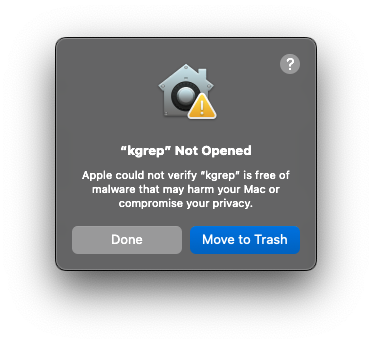

# kgrep

[](LICENSE)
[](https://github.com/hbelmiro/kgrep/actions/workflows/ci.yaml/badge.svg)
[](https://github.com/hbelmiro/kgrep/releases)

`kgrep` is a command-line utility designed to simplify the process of searching and analyzing logs and resources in Kubernetes. Unlike traditional methods that involve printing resource definitions and grepping through them, `kgrep` allows you to search across multiple logs or resources simultaneously, making it easier to find what you need quickly.

## Key Features

* **Resource Searching**: Search the content of Kubernetes resources such as configmaps for specific patterns within designated namespaces.

* **Log Searching**: Inspect logs from a group of pods or entire namespaces, filtering by custom patterns to locate relevant entries.

* **Namespace Specification**: Every search command supports namespace specification, allowing users to focus their queries on particular sections of their Kubernetes cluster.

* **Pattern-based Filtering**: Utilize pattern matching to refine search results, ensuring that only the most pertinent data is returned.

## Installation

### Prerequisites

- [kubectl](https://kubernetes.io/docs/tasks/tools/install-kubectl/) installed and configured to connect to your
  Kubernetes cluster.

### Download the binary and add it to your PATH

Download a release from https://github.com/hbelmiro/kgrep/releases, uncompress it, and add it to your PATH.

#### ⚠️ Unverified app warning in macOS

You can see this warning when trying to run `kgrep` for the first time on macOS.

```
"kgrep" Not Opened
Apple could not verify "kgrep" is free of malware that may harm your Mac or compromise your privacy.
```



If you see that, click "Done" and allow `kgrep` to run in macOS settings, like the following screenshot.


When you try to run it again, you'll see a final warning. Just click "Open Anyway" and it won't warn you anymore.


## Example

To search for `example` in `ConfigMaps` definitions in the `my_namespace` namespace: 

```shell
$ kgrep configmaps -n my_namespace -p "example"
configmaps/example-config-4khgb5fg64[7]:     internal.config.kubernetes.io/previousNames: "example-config-4khgb5fg64"
configmaps/example-config-4khgb5fg64[48]:   name: "example-config-4khgb5fg64"
configmaps/example-config-5fmk4f7h8k[7]:     internal.config.kubernetes.io/previousNames: "example-config-5fmk4f7h8k"
configmaps/example-config-5fmk4f7h8k[57]:   name: "example-config-5fmk4f7h8k"
configmaps/acme-manager-config[104]:     \  frameworks:\n  - \"batch/job\"\n  - \"example.org/mpijob\"\n  - \"acme.io/acmejob\"\
configmaps/acme-manager-config[105]:     \n  - \"acme.io/acmecluster\"\n  - \"jobset.x-k8s.io/jobset\"\n  - \"example.org/mxjob\"\
configmaps/acme-manager-config[106]:     \n  - \"example.org/paddlejob\"\n  - \"example.org/acmejob\"\n  - \"example.org/tfjob\"\
configmaps/acme-manager-config[107]:     \n  - \"example.org/xgboostjob\"\n# - \"pod\"\n  externalFrameworks:\n
```

💡 Type `kgrep --help` to check all the commands.

## Building the project

This project uses Quarkus, the Supersonic Subatomic Java Framework.

If you want to learn more about Quarkus, please visit its website: https://quarkus.io/ .

## Running the application in dev mode

You can run your application in dev mode that enables live coding using:
```shell script
./mvnw compile quarkus:dev
```

> **_NOTE:_**  Quarkus now ships with a Dev UI, which is available in dev mode only at http://localhost:8080/q/dev/.

## Packaging and running the application

The application can be packaged using:
```shell script
./mvnw package
```
It produces the `quarkus-run.jar` file in the `target/quarkus-app/` directory.
Be aware that it’s not an _über-jar_ as the dependencies are copied into the `target/quarkus-app/lib/` directory.

The application is now runnable using `java -jar target/quarkus-app/quarkus-run.jar`.

If you want to build an _über-jar_, execute the following command:
```shell script
./mvnw package -Dquarkus.package.type=uber-jar
```

The application, packaged as an _über-jar_, is now runnable using `java -jar target/*-runner.jar`.

## Creating a native executable

You can create a native executable using: 
```shell script
./mvnw package -Dnative
```

Or, if you don't have GraalVM installed, you can run the native executable build in a container using: 
```shell script
./mvnw package -Dnative -Dquarkus.native.container-build=true
```

You can then execute your native executable with: `./target/kgrep-<version>-runner`

Rename the `./target/kgrep-<version>-runner` executable file to `kgrep` and add it to your PATH.

If you want to learn more about building native executables, please consult https://quarkus.io/guides/maven-tooling.